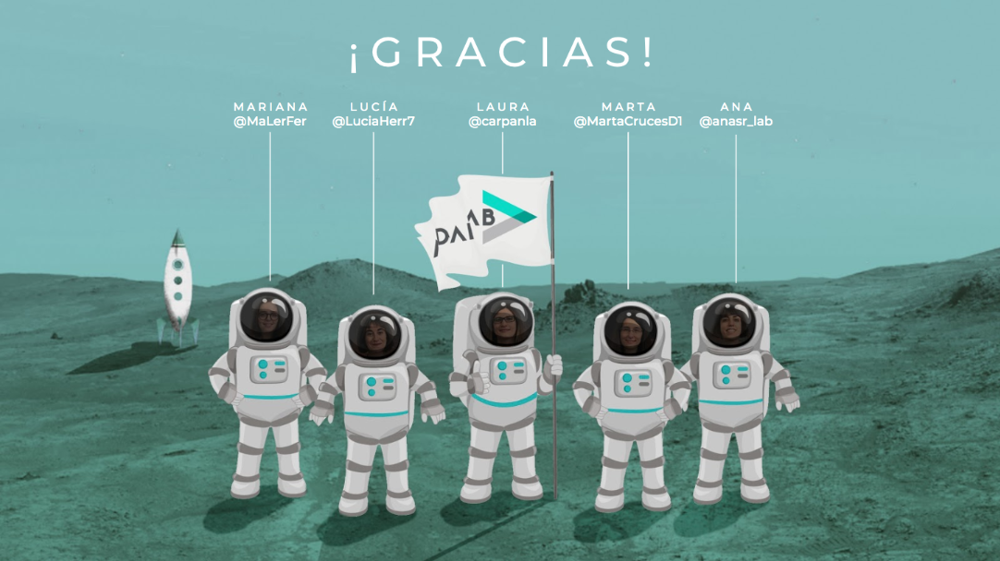

# Skylabers
#### *Contact us!*

This is the first site we created at Adalab. If you want to know more about us and about what we do please visit [our team's website](http://beta.adalab.es/contact-us-skylabers/).




----

### Getting started

If you want to play around with our project, please visit [our Github repository](https://github.com/Adalab/contact-us-skylabers) to clone or download it.
* To clone it: copy this [link](https://github.com/Adalab/contact-us-skylabers.git) and go to your terminal. Once in the terminal, navigate to the directory where you want to install it and use the command:

```$ git clone https://github.com/Adalab/contact-us-skylabers.git```

* To download it: you can download the zip version using the clone or download tab on the repository and unzip it in your local directory.


### Installing

* On your terminal, make sure you are in your *contact-us-skylabers* folder and run the commands:

`$ npm install`

`$ npm start` or `$ gulp`

* Gulp will create the `public`folder and will run a local server where any changes will immediately show.
* You can also create a `docs`folder by running `gulp docs`on your terminal.


### Technologies

* HTML 5.
* CSS - SCSS.
* Gulp


### Team

We are a team of five women from very different backgrounds that came together through Adalab Bootcamp in Madrid and this is our first project. We are [Marta Cruces](https://github.com/Marta-Cruces), [Laura Carril](https://github.com/carpanla), [Mariana Lerma](https://github.com/marianalfr), [Lucía Herrador](https://github.com/luciaherrrador), y [Ana Sánchez](https://github.com/ana-sanchez)

### MIT License.

Copyright (c) 2019 Skylabers

Permission is hereby granted, free of charge, to any person obtaining a copy
of this software and associated documentation files (the "Software"), to deal
in the Software without restriction, including without limitation the rights
to use, copy, modify, merge, publish, distribute, sublicense, and/or sell
copies of the Software, and to permit persons to whom the Software is
furnished to do so, subject to the following conditions:

The above copyright notice and this permission notice shall be included in all
copies or substantial portions of the Software.

THE SOFTWARE IS PROVIDED "AS IS", WITHOUT WARRANTY OF ANY KIND, EXPRESS OR
IMPLIED, INCLUDING BUT NOT LIMITED TO THE WARRANTIES OF MERCHANTABILITY,
FITNESS FOR A PARTICULAR PURPOSE AND NONINFRINGEMENT. IN NO EVENT SHALL THE
AUTHORS OR COPYRIGHT HOLDERS BE LIABLE FOR ANY CLAIM, DAMAGES OR OTHER
LIABILITY, WHETHER IN AN ACTION OF CONTRACT, TORT OR OTHERWISE, ARISING FROM,
OUT OF OR IN CONNECTION WITH THE SOFTWARE OR THE USE OR OTHER DEALINGS IN THE
SOFTWARE.
